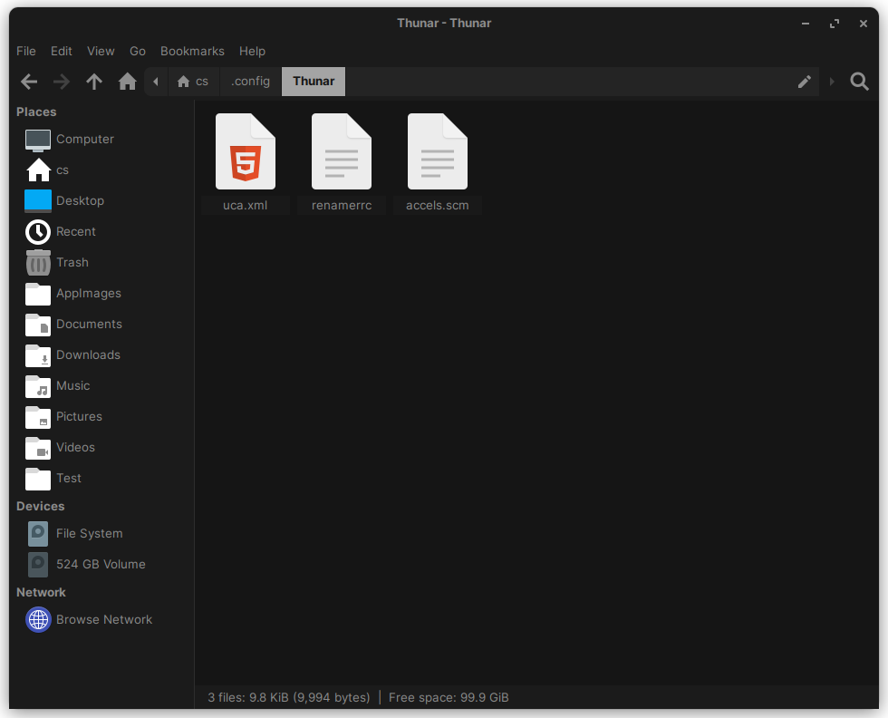

# Configuration

The following document describes all the relevant configuration, preferences, and look-and-feel of the LiveCD.

## AppImages

AppImages will replace packages not available in nixOS in the `$HOME/AppImages` directory.

Managing and integrating these AppImages into the desktop environment will be up to [AppImageLauncher](https://github.com/TheAssassin/AppImageLauncher) Lite, where it will be configured to look for `$HOME/AppImages`. The AppImageLauncher AppImage wil also be placed in the same directory.

It should be trivial to make a nixOS equivalent package of any AppImages via [appimageTools](https://nixos.org/manual/nixpkgs/stable/#sec-pkgs-appimageTools). The only problem is that the cost of maintaining each AppImage grows faster than the benefit of integrating each one, resulting in a large increase of complexity. Our AppImageLauncher method on the other hand only requires you to place the AppImage under the directory and periodically open the tool to integrate the AppImages.

## Display Manager

In my opinion the only  real choices are [LightDM](https://github.com/canonical/lightdm) because of their modern support and theme customizability. While [GDM](https://github.com/GNOME/gdm) also has these characteristics, I anecdotally never actually had to manually login with a DM for more than twice in a month, which makes a more resource draining GDM costly. Plus, theming tools like [Nody Greeter](https://github.com/JezerM/nody-greeter) allow LightDM to have a nice UI experience even without GNOME integrations.

## File Manager

There are some instances with GTK File Picker where it is hard coded such that only Gnome's [Nautilus](https://github.com/GNOME/nautilus) file manager can be opened, regardless of any other default file manager in the system. To remedy this there will be a primary file manager, [Thunar](https://gitlab.xfce.org/xfce/thunar), for daily use and a secondary file manager used for any situation where the primary file manager cannot be used. 

With GNOME 45's recent UX [changes](https://9to5linux.com/gnome-45s-nautilus-file-manager-gets-a-modern-full-height-sidebar-layout) to Nautilus, I am seriously considering switching to it once GNOME 45 hits stable release.

[comment - Make an explicit reference to the GNOME section in the future]: #

### Thunar


*What the Thunar File Manager should look like*

Create the following 'Open Terminal Here' and 'Open as Root' actions under `$XDG_CONFIG_HOME/.config/Thunar/uca.xml`'s `<actions></actions>` block:

```xml
<actions>
	<action>
		<icon>utilities-terminal</icon>
		<name>Open Terminal Here</name>
		<submenu/>
		<unique-id>1689224791084051-1</unique-id>
		<command>exo-open --working-directory %f --launch TerminalEmulator</command>
		<description>Example for a custom action</description>
		<range/>
		<patterns>*</patterns>
		<startup-notify/>
		<directories/>
	</action>
	<action>
		<icon>dialog-password</icon>
		<name>Open as Root</name>
		<submenu/>
		<unique-id>1689401683694822-1</unique-id>
		<command>pkexec thunar %f</command>
		<description/>
		<range>*</range>
		<patterns>*</patterns>
		<directories/>
	</action>
	<action>
		<icon/>
		<name/>
		<submenu/>
		<unique-id>1689402208795292-2</unique-id>
		<command/>
		<description/>
		<range>*</range>
		<patterns>*</patterns>
	</action>
...
</actions>
```

where the packages `exo-utils` and `pkexec` are required to implement the actions.

### Nautilus

No additional configurations are necessary. 

## Networking

[NetworkManager](https://networkmanager.dev/) is sufficient for Internet with ease of use and GNOME integration. 

## Terminal

[Sakura](https://github.com/dabisu/sakura) will used with `scrollbar=true` enabled in `sakura.conf`. This terminal emulator feels the cleanest with keeping all the most necessary features without intruding on my workflow. Specifically, having the special features hidden in just one right click away feels intuitive as someone might need them quickly from time to time but for the most part just wants to use the console. 

## Video Player

[mpv](https://mpv.io/) is used because it supposedly less bloated than VLC, is popular enough for wide support, and is what I am familiar with.
